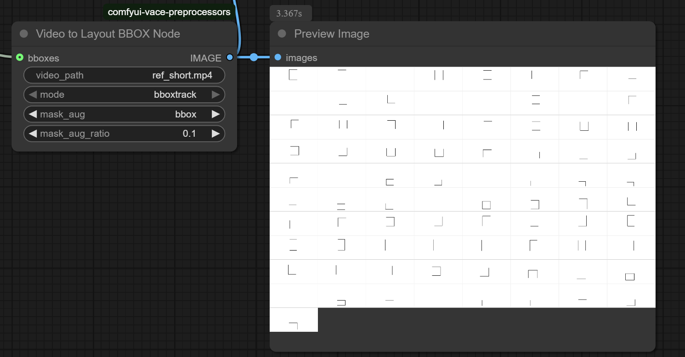

# Vace Preproccess Nodes

# Installation
1. Clone this repo into `custom_nodes` folder.
2. Install dependencies: `pip install -r requirements.txt`
   or if you use the portable install, run this in ComfyUI_windows_portable folder:

  `python_embeded\python.exe -m pip install -r ComfyUI\custom_nodes\comfyui-vace-preprocessors\requirements.txt`

## Models

You might already have some of the models from other sources, double check:

1. Create a `salient` directory in ComfyUI/models and add u2net.pt file from [https://huggingface.co/ali-vilab/VACE-Annotators/resolve/main/salient/u2net.pt?download=true](https://huggingface.co/ali-vilab/VACE-Annotators/resolve/main/salient/u2net.pt?download=true)
2. Create a `sam2` directory in ComfyUI/models and have these files there [https://huggingface.co/ali-vilab/VACE-Annotators/tree/main/sam2](https://huggingface.co/ali-vilab/VACE-Annotators/tree/main/sam2)
3. Create a `grounding-dino` directory in ComfyUI/models and have these files there [https://huggingface.co/ali-vilab/VACE-Annotators/tree/main/gdino](https://huggingface.co/ali-vilab/VACE-Annotators/tree/main/gdino) and rename GroundingDINO_SwinT_OGC.py to GroundingDINO_SwinT_OGC.cfg.py

